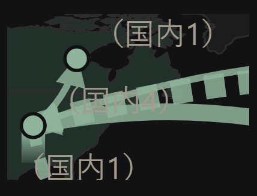

# 約束の根を白抜きに・押したら網と根を並べる・すき間を消した（v20.32）

日付：2026-09-13　元の回答書：`shiji/kaitou_ne_naoshi_2026-09-13.md`
前の報告：[2026-09-13_ne_naoshi.md](2026-09-13_ne_naoshi.md)
仕様書：[`spec/sekai_jibun_dai3dan.md`](../spec/sekai_jibun_dai3dan.md)（第5版）

---

## 何をしたか

回答書の判断1〜3を実装して公開した（v20.32、commit d469cec。公開先の index.html が手元と同じになったのを確かめた）。

1. **約束の根**を「白抜き（輪郭1px）＋下へ消える」にした。輪郭の濃さは0.9→0.2で、**薄さ0.4は掛けない**。3.5pxより細い約束の根は白抜きにできないので、消え方を弱く（0.85→0.5）×薄さ0.4で描く
2. **点か根を押すと、地図の下に、その国の「網」と「根（N本）」の2つを並べる。** 近くの別の国の点や根も押す範囲に入っていれば、その国の2つも並べる。根の無い点や線は今までどおり。「前に選んだほうを直接開く」は作っていない
3. **根を点の中心から描く**ようにした（点の下に隠れて、点と根のすき間が見えない）。触れる判定と押す範囲は、今までどおり点の縁から測る
4. 地図の下の1行目の案内を「国の点か根を押すと、その国の網と根を地図の下から選べます。線を押すと、その動きを出します。」にした。数字の見方にも、約束の根の白抜きと、網と根を選ぶことを書いた

**切り替える値は、根の決まった1か所にまとめた：** 約束の根の形（白抜き／弱く消える／薄いだけ）・白抜きにする太さの下限（3.5px）・白抜きの濃さ・弱く消える濃さ・点か根を押したときの形（並べる／押し分ける＝v20.31／一覧＝v20.30）・根の押す範囲（4px）・点の押す範囲（4px）・根の描き始め（0px）。

## 結果（先に）

1. **カナダの約束の根は白抜きで描かれた。** 輪郭1pxで、薄さは掛かっていない（画面の濃さ1）。ほかの5本はふつうの消える形
2. **点を押しても根を押しても、6か国ともその国の2つが並んだ。** 例：「日本： 日本の網 ／ 日本の根（4本）」
3. **日本と台湾の間を押すと、4つ並んだ：** 「この辺りの国と根： 日本の網 ／ 日本の根（4本） ／ 台湾の網 ／ 台湾の根（2本）」
4. 並んだ「日本の網」を押すと日本の網、「日本の根」を押すと日本の根の一覧（5枚）が開いた。戻ると地図
5. 根の無い点（ベネズエラ）は、今までどおり「この辺りの線・国」
6. **6本とも、根は点の中心から描かれている**（描き始めのずれ 0px）
7. **「全部」の画面は v20.31 と同じ。** 5地域×6種類の30通りで比べ、変わったのは「自分に使う」の1行目の案内の文だけ
8. **気づいたこと：カナダの根の上には、米国からカナダへ来る線（2px）の矢印の先が重なる。** 拡大して見ると、白抜きの根の上に矢印の先が乗っていた（下の絵）。**実機でカナダの根が見えにくいのは、薄さだけでなく、この重なりのせいもあるかもしれない**。今回は直していない
9. エラーは0

---

## 確かめたこと

本物のデータの写し（今日の kotoba-data と同じ中身、直近90日）で、試験用のページを使って確かめた。

### 形

| 確かめたこと | 結果 |
|---|---|
| 約束の根（カナダ・5px） | 白抜き1本。輪郭の太さ1px、中は塗らない、画面の濃さ1（薄さ0.4が掛かっていない）、輪郭の濃さは点の縁から先へ 0.9→0.2 |
| ふつうの根 | 5本（米国・メキシコ・中国・日本・台湾）。今までの消える形 |
| 描き始め | 6本とも点の中心から（ずれ 0.0px） |
| 白抜きの下限を6pxにした試しのページ | カナダ（5px）が「消え方を弱く」になり、薄さ0.4が掛かった。白抜きは0本。**下限の値が1か所で効く** |

カナダの辺りを拡大（5倍）した絵。上の点がカナダ。白抜きの根の上に、左下の米国から来る線の矢印の先が重なっている：

### 押したとき（D にしたあと）

| 押した所 | 出たもの |
|---|---|
| カナダの根・点 | 「カナダ： カナダの網 ／ カナダの根（1本）」（根も点も同じ） |
| 米国の根・点 | 「アメリカ合衆国： アメリカ合衆国の網 ／ アメリカ合衆国の根（4本）」 |
| メキシコの根・点 | 「メキシコ： メキシコの網 ／ メキシコの根（1本）」 |
| 中国の根・点 | 「中華人民共和国： 中華人民共和国の網 ／ 中華人民共和国の根（2本）」 |
| 日本の根・点 | 「日本： 日本の網 ／ 日本の根（4本）」 |
| 台湾の根・点 | 「台湾： 台湾の網 ／ 台湾の根（2本）」 |
| **日本の根と台湾の点の間** | **「この辺りの国と根： 日本の網 ／ 日本の根（4本） ／ 台湾の網 ／ 台湾の根（2本）」** |
| 並んだ「日本の網」 | 日本の網が開いた → 戻ると地図 |
| 並んだ「日本の根（4本）」 | 日本の根の一覧（5枚）が開いた → 戻ると地図 |
| ベネズエラの点（根なし） | 「この辺りの線・国」にベネズエラとシェブロン→ベネズエラの線（今までどおり） |
| 押し分けに戻した試しのページ | 中国の根で根の一覧、中国の点で網が直接開いた（v20.31 と同じ）。**押し分けの形の値が1か所で効く** |

### 数の確かめ・触る確かめ

| # | 確かめたこと | 結果 |
|---|---|---|
| — | 「全部」の画面が v20.31 と同じか | 30通りで同じ。違ったのは「自分に使う」を選んだ5つの画面の1行目の案内の文だけ |
| 1〜5 | 言葉の一覧・世界の画面・概念の一覧・お金の一覧の探す欄、聞く欄に本物のキーで2文字 | 5つとも入り、フォーカスも残った |
| 6 | 地図の種類・地域 | 「お金（51）」で線30本、「欧州（8）」で線8本 |
| 7 | 件数 → 一覧 → 戻る | 「場所不明 4件」→ 4枚 → 地図 |
| 8 | 札を開いて「詳しく」 | 開いた（文字 610 → 976） |
| 9 | 「自分に使う」→ 根、「全部」→ 消える | 根 0 → 6本 → 0 |
| 10・11 | 根を押す、日本と台湾・米国とメキシコの辺り | 上の表のとおり、その国の2つ（日本と台湾の間は4つ）が並ぶ |
| 12 | 「根だけ描いたもの 2本」 | TSMC の2枚の一覧 |
| 14 | 地域を変えながら「自分に使う」 | 全体20＝根14＋線6、米州11＝6＋5、欧州1＝0＋1、中東2＝0＋2、アジア10＝8＋2 |
| 15 | 米国の網の⊥ | ⊥4本・矢印16本、⊥の矢印を押すと一覧 |

---

## 失うもの

- **網も根も、いつも1回多く押す**（回答書の心配どおり）
- 点や根の上を通る線は、そこでは選べない（線から離れた所で押す）
- カナダの白抜きの根は、米国からの線の矢印と重なる所がある（上の「気づいたこと」）

## 実機で見るもの（回答書の5つ）

1. カナダの約束の根が見えるか（白抜き。米国からの線の矢印と重なる所も見てほしい）
2. 白抜きが「U」の字や枠に見えないか
3. 点を押しても根を押しても、その国の2つが出るか。選ぶのが面倒に感じないか
4. 日本と台湾の辺りで、4つ並んだときに選べるか
5. すき間が消えているか

白抜きが「U」の字に見えたら、1か所の約束の根の形を「弱く消える」に変える。選ぶのが煩わしければ、押したときの形の値で押し分け（v20.31）にも戻せる。

## 残り

- 実機での判断
- カナダの根と米国→カナダの線の矢印の重なり（見えにくければ、次に扱う）
- 持ち越し：直さなかった6件（撮るの↑、地層の印4つ、網の真ん中のカード）、確かめられなかった3つ（日本語の変換、API の返事の後、長押し・なぞる・つまむ）
