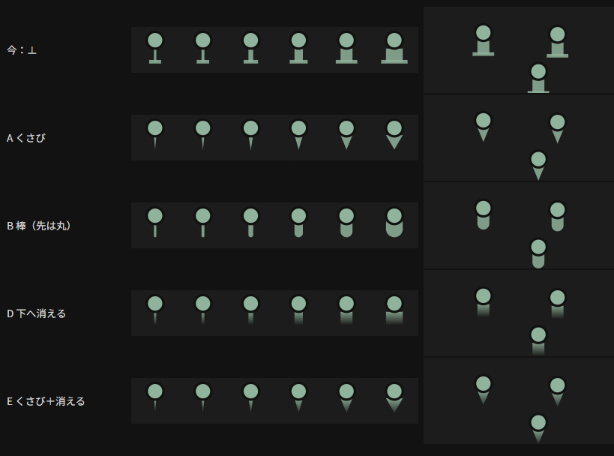

# 根の先の形：案と推奨（⊥ が「人」に見える件）＋ 押したとき・1行目の直し方

日付：2026-09-13　元の指示書：`shiji/shiji_ne_katachi_2026-09-13.md`　起点：v20.30
**実装はしていない。** 案と推奨と実測だけ（選んでもらってから実装する）。

---

## 何をしたか

- 今の⊥と、先の形の候補6つを、**実際の地図と同じ色・大きさ**（根9px・点の半径3.5px・暗い地図の地）で、太さの全段（1・1.2・2・3.5・5・7px）を並べて描いて見比べた。日本・台湾・中国の3本が並ぶ所も同じ位置関係で描いた
- 長さを11pxにした場合と、約束の根（薄い）の場合も描いた
- 形ごとに、日本の根と台湾の点のすき間を計算した（今の⊥で計算した値が、前に画面で測った値と合うことを確かめてから）

見比べた絵（3倍に拡大。左が太さ1〜7pxの段、右が日本・台湾・中国の並び）：



## 結果（先に）

- **推奨は「D 下へ消える」**：点から下へ、太さはそのままで、先に行くほど薄くなって消える。水や地面に沈んでいく見え方になる。人・ピン・雪だるまなど、**ほかの物の形に見えない**のはこれだけだった
- ⊤（地表の線＋杭）は腕を広げた人、棒＋先の点は雪だるまや鍵穴に見えたので、候補から外した
- どの形に変えても、**日本の根は台湾の点に触れなくなる**（今の⊥は幅320で0.8pxしか空いていない。消える形なら2.8px）。画面320ptの初代 SE でも日本の根が出るようになる
- **網の⊥は変えないことを勧める**（理由は 3.）
- 根を押したら直接開く直し方と、「自分に使う」の1行目の直し方も書いた（4.・5.）

---

## 1. 案

| 案 | 形 | 伝わるもの | 失うもの |
|---|---|---|---|
| **D 下へ消える（推奨）** | 太さそのままの棒が、下へ行くほど薄くなって消える | **沈む・下に積まれて見えなくなる。** ほかの物の形に見えない | 先の端がはっきりしない。**点の影や映り込みに見える**恐れ。約束の根（薄い）と重なると、細い段（1〜2px）はかなり薄くなる |
| A くさび | 点の下で太さいっぱい、先へ向かって尖る三角 | 刺さる・打ち込む | **太い段（5・7px）は地図のピン（場所の印）に見える。** 下向きの矢印の先にも見え、「下へ動いた」と読める。細い段は針のような線になり、くさびには見えない |
| B ただの棒（先は丸） | 太さそのままの棒、先を丸く | 伸びている、下がっている | 沈む感じは出ない。太い段は体温計・カプセルのように見える。ただ、ほかの物に強く見えることはない |
| E くさび＋消える | 三角が先へ行くほど薄く | 刺さって沈む | 太い段はやはりピンに見える。形が2つ重なって、細い段では何も起きていないように見える |
| （外した）C 棒＋先の点 | 細い棒の先に丸 | おもり・錨 | 点の下に点が付き、**雪だるま・鍵穴に見える** |
| （外した）F ⊤ | 点のすぐ下に横の線、その下へ杭 | 地表の下へ | **腕を広げた人に見える**（今の⊥より人らしい） |

## 2. 確かめてほしいこと（4つ）への答え

### 2-1. 太さ1〜7pxの全部で、その形が見えるか

| 太さ | D 下へ消える | A くさび | B 棒（先は丸） |
|---|---|---|---|
| 1px・1.2px | 細い線が下で消える。消える感じは分かるが弱い | 細い針。**くさびには見えない**（尖りが1px以下） | 細い棒。丸い先は見えない |
| 2px | 消える感じが分かる | 尖っているのがやっと分かる | 棒 |
| 3.5px | はっきり沈んで見える | 小さな三角 | 先の丸が分かる |
| 5px | はっきり沈んで見える | **ピンに見え始める** | カプセル |
| 7px | 太い棒が沈んでいく | **ピン** | 太いカプセル |
| 約束（薄い） | 1〜2pxは消えかける。3.5px以上は読める | 形は残る | 形は残る |

**D で細い段が弱い件の手当て：** 先で完全に透明にせず、**先でも少し残す**（濃さ0.85 → 0.15）。E はこの形で描いた。D も実装するならこの形にする。

### 2-2. 長さ9pxで足りるか

- **A・B は9pxで足りる。**
- **D は9pxだと、濃く見えるのは点のすぐ下の3〜4pxだけ**になり、影に見えやすい。**11pxのほうが「沈んでいく」がはっきりする**（絵で確かめた）
- 11pxにしても、形が細くなる分、**今の⊥の9pxより日本と台湾のすき間は広い**（下の表）。前の報告で「11pxなら375pt以上で日本は消えない」と書いたのは⊥での値で、D なら**288px（320pt）でも消えない**
- 推奨：**D を11pxで試す。** 長さも先の形と同じ1か所で変えられるようにする

### 2-3. 網の矢印9本も揃えるか → **揃えないことを勧める**

- 網では⊥が「人」に見えるという話は出ていない。網の⊥は、2つの点を結ぶ矢印の先を止める形で、**点の下にぶら下がる形ではない**ので、人の形にならない
- 網の矢印は曲線で、「下へ」という向きが無い。消える形にすると、**線が途中で切れたように見える**
- 実機で「網の⊥、よい」と見てもらったものを変えない
- **失うもの：** 地図（消える）と網（⊥）で、自分に使う金の印の形が違う。数字の見方に「地図では下へ消える根、網では先が⊥の矢印」と両方書く

### 2-4. 触れる判定は変わるか → **変わる。すき間が広がる**

日本の根（5px）と台湾の点のすき間（点の半径3.5＋縁0.5を含めて。形の全体を、薄くなる所も含めて測った）：

| 地図の幅（画面の幅） | 今の⊥ 9px | D 9px | D 11px | A 9px | B 9px |
|---|---|---|---|---|---|
| 288（320pt） | **−0.8（触れる）** | 1.3 | 0.3 | 3.4 | 2.3 |
| 320（352pt） | 0.8 | 2.8 | 1.6 | 4.7 | 3.8 |
| 343（375pt） | 1.9 | 3.9 | 2.5 | 5.7 | 4.9 |
| 358（390pt） | 2.7 | 4.6 | 3.2 | 6.4 | 5.6 |

- **何を含めて測ったか：** 点は半径3.5＋縁の線0.5。⊥は縦棒の太さと横棒（幅＝太さ＋4・太さ1.5）。D は太さ5の長方形（薄い所も形に含める＝多めに触れる側で数えた）。A は上辺5pxの三角。B は先が丸い棒。線と字は含めていない
- 今の⊥の値（幅320で0.8px）は、前に実装した画面で測った値（0.81px）と合った
- **触れる判定の決まりは同じまま使える**（形ごとに「形の範囲」を測るだけ）。⊥の横棒が無くなるので、どの形でも広がる
- 米国（7px）とメキシコの点：今の⊥で幅288なら2.9px → D で4.7px

## 3. 先の形を1か所で切り替える形

アプリの中の根の決まった場所（根を出すかどうか・長さと同じ所）に、**先の形の値を1つ**置く：`消える`／`くさび`／`棒`／`⊥`。変えるのはこの値だけで、地図の根の描き方と触れる判定が一緒に切り替わる。網は⊥のまま（2-3）。

---

## 4. 根を押すと必ず「この辺りの線・国」が出る件の直し方

### 決まり（案）

押した所が**根の上**なら、ほかに近いものがあっても、**その国の根の一覧を直接開く**。

- **根の上：** 根の形の範囲から左右に4pxずつ広げ、下は先から4pxまで、上は**その国の点の下の縁より下**
- 根の上でなければ、今までどおり（22px の中の点と線を集めて、1つならすぐ開く、2つ以上なら一覧）

### 失うもの

- **国の点のすぐ下を押すと、国の網ではなく根の一覧が開く。** 網を開くには、点そのものか点より上を押す
- **根の上を通る線は、根の上では選べない。** 今のデータでは、カナダの根の上を米国→カナダの線、米国の根の上を日本→米国の7px破線と米国→ベネズエラの線が通る。これらの線は、根から離れた所を押して選ぶ
- 日本の根の範囲と台湾の点が近い：台湾の点の右上の縁を押すと、日本の根が開くことがある（地図の幅320・根9pxで、日本の根の押す範囲の左下の角が、台湾の点の縁の中に約3px入る。計算。左右の広げ方を4pxより狭くすれば減るが、そのぶん指で当てにくくなる）
- 押す範囲は幅が狭い（根の太さ＋8px、長さ約10px）ので、指が少しずれると今までどおりの一覧になる

## 5. 「自分に使う」の画面の1行目の直し方

今：
```
直近90日：国をまたぐ線 6本・枠への線 0本・国内 9件。二本指で拡大・縮小、…
自分に使う 20本：根 14本（6か国）・相手が別の国の線 6本
相手の場所が分からず、主体の国に根だけ描いたもの 2本
```

| 案 | 1行目 | 失うもの |
|---|---|---|
| **a（推奨）1行目を根の数え方に置き換える** | `直近90日：自分に使う 20本＝根 14本（6か国）・相手が別の国の線 6本。二本指で拡大・縮小、…` として、今の2行目は消す | 国内 9件・枠への線（トヨタの3本）という内訳が画面から消える（根を押せば中身は見られる） |
| b 1行目をやめて2行目だけ | 2行目が先頭。「二本指で拡大・縮小…」の使い方の文が「自分に使う」の画面だけ無くなる | 使い方の文 |
| c 1行目に根の内訳まで入れる | `直近90日：根 14本（国内 9・市場の枠 3・場所不明 2）・相手が別の国の線 6本。…` | 1行が長くなり、幅320で3行に折り返す。内訳は根の意味（持ち主の側に積んだ）と関係が薄い |

**a を勧める。** 足し算が要らず、2行目との重なりも消える。「根だけ描いたもの 2本」「〇〇の図で見られる根」の行はそのまま残す。

---

## 判断をください

1. 先の形：**D 下へ消える（11px）を勧める。** 次の候補は B（ただの棒）、その次が A（くさび）
2. 網の⊥は変えない、でよいか
3. 押したとき：根の上なら直接開く（4.）でよいか
4. 1行目：a でよいか

選んでもらったら、先の形と長さを1か所で切り替えられる形にして、4.・5. と一緒に実装・公開する。

## 残り

- 絵は PC の画面で3倍に拡大して見たもの。**iPhone の画面での見え方は実機でしか分からない**（特に D が影に見えないか）
- 前の報告からの持ち越し（直さなかった6件、確かめられなかった3つ）は変わらず
