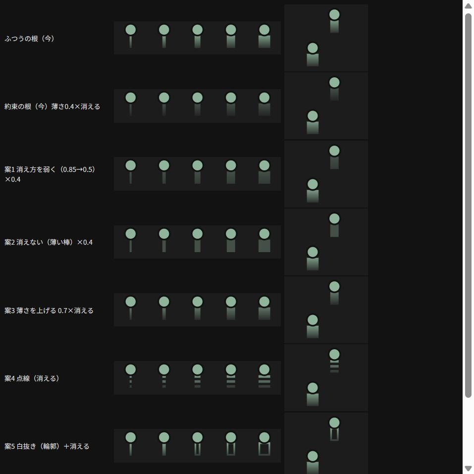
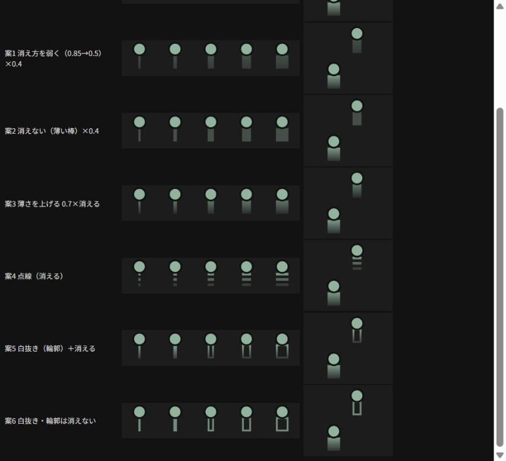

# 実機で見た根の直し：約束の根が見えない件と、押し分けの件（案と推奨）

日付：2026-09-13　元の指示書：`shiji/shiji_ne_naoshi_2026-09-13.md`　起点：v20.31
**実装はしていない。** 案と推奨と実測だけ（選んでもらってから実装する）。

---

## 何をしたか

- 今の約束の根（薄さ0.4×下へ消える）と、候補6つを、ふつうの根と並べて、太さの段（1.2・2・3.5・5・7px）と長さ11pxで描いて見比べた。カナダ（約束・5px）と米国（ふつう・7px）の位置関係でも描いた
- 線の「約束」が今どう描かれているかを確かめた
- 根と点のすき間を、根の始まりを変えて拡大して見比べた
- 今の押す範囲（点と根の境目）を、コードの決まりから数字で出した

## 結果（先に）

1. **約束の根は「白抜き（輪郭だけ）＋下へ消える」を勧める。** 線の約束が「薄い線＋**白抜きの矢印**」なので揃う。中身が無い形は「まだ動いていない金」と意味も合う。薄さを掛けないので、ふつうの根と同じくらい見える
2. **線の約束は、点線ではない。** 薄い線（0.4）＋白抜きの矢印。点線は「物・人・換算できないもの」、破線は「期間の累計・期間あたり」にもう使われているので、約束の根を点線にすると意味がぶつかる
3. **押し分けは、今の大きさでは無理だと考える。** 点と根を合わせても縦に約22px、指の当たる大きさの目安（44pt）の半分しかない。**「押した国の網と根の2つだけを並べる短い一覧」を勧める**
4. **根と点のすき間は直す。** 値1つ（根の始まり）を変えるだけで、描く順も触れる判定も押す範囲も変わらない

---

## 1. 約束の根（カナダ）が見えない件

### 1-1. 今どうなっているか

- 約束の根は「薄さ0.4」を**根全体に**掛けている。そこに「下へ消える」（0.85→0.15）が重なり、濃さは点の下で0.34、先で0.06になる
- 線の約束は「**薄さ0.4＋白抜きの矢印**」。点線は物・人・換算できないもの、破線は期間の累計・期間あたり

### 1-2. 案

見比べた絵（3倍。上から、ふつうの根・今の約束の根・案1〜5。右はカナダ（上・約束）と米国（下・ふつう））：

（案1〜6。案5・6が白抜き）

| 案 | 見えるか | ふつうの根と見分けがつくか | 失うもの |
|---|---|---|---|
| 今（薄さ0.4×消える） | **ほぼ見えない**（実機のとおり） | — | — |
| 1 消え方を弱く（0.85→0.5）×0.4 | 見える。暗くくすんだ棒 | つく（暗い・あまり消えない） | 暗くて、地図の暗い地の上で目立たない。「沈む」は弱い |
| 2 消えない（薄い棒）×0.4 | 見える | つく（消えない・暗い） | 「沈む」形が約束の根だけ無くなる。ふつうの根と形の決まりが2つになる |
| 3 薄さを上げる（0.7×消える） | よく見える | **つきにくい**（ふつうの根と濃さが近い） | 約束とふつうの見分け |
| 4 点線（消える） | 見える | つく | 太い段は**横縞のはしご**に見える。点線は線で「物・人・換算できない」の意味なので**意味がぶつかる** |
| **5 白抜き（輪郭）＋消える（推奨）** | **見える**（輪郭は薄さを掛けず0.9→0.2） | **つく**（中が暗い） | **太さ2px以下は白抜きにできない**（中が作れない）。3.5px以上は、下が薄く消えるので「U」の字のように見える恐れ |
| 6 白抜き・輪郭は消えない | 見える | つく | 「沈む」形が無くなる。はっきり「U」や枠に見える |

### 1-3. 推奨：案5（白抜き＋消える）、細い段は案1

- **線の約束（白抜きの矢印）と揃う。** 「中身がまだ無い」形なので、まだ動いていない金と読める
- 薄さを掛けないので、**約束の根だけ見えないことが無くなる**
- **太さ2px以下は白抜きにできない**ので、そこだけ案1（消え方を弱く×0.4）にする。今のデータの約束の根はカナダの5pxだけで、細い約束の根は無い
- 次の候補は案1（全部の太さで同じ形。ただし暗い）

**「約束の根とふつうの根の見分けがつかなくなる」が起きるのは案3。** 案5は中が暗く、案1・2は暗さで見分けがつく。

**切り替える値（1か所）：** 約束の根の形（`白抜き`／`弱く消える`／`消えない`／`今のまま`）、弱く消えるときの濃さ（0.85→0.5）、白抜きにする太さの下限（3.5px）。

---

## 2. 根と点の押し分け

### 2-1. いま境目はどこか

**点の下の縁ちょうど（点の中心から3.5px下）。**

| 押した所 | 開くもの |
|---|---|
| 点の中心から7.5px以内で、点の下の縁より上（左右は根の範囲の外なら縁より下も） | その国の網 |
| 点の下の縁から、根の先の4px下まで（点の中心から3.5〜15px）、左右は根の太さ＋4pxずつ（5pxの根なら幅13px） | その国の根の一覧 |
| どちらでもない | 今までどおり（22px の中を集めて、1つならすぐ開く、2つ以上なら一覧） |

### 2-2. 押し分けられる大きさか → **押し分けられない**

- 点と根を合わせた押す範囲は、縦に約22px（点の上7.5px＋根の15px）。そのうち網になるのは上の約11px、根になるのは下の約11px
- **指で押すときの目安（iPhone の決まりで44pt四方）の半分**の大きさを、さらに上下2つに分けている。指の当たる所の真ん中が数px上下するだけで、網と根が入れ替わる（押した位置のずれは、実機でしか測れない。測っていない）
- つまり実機で「押すたびに変わる」は、この大きさなら起きて当然

### 2-3. 案

| 案 | どうなるか | 失うもの |
|---|---|---|
| A 境目を上に寄せる（点の中心より上＝網、下＝根） | 根の範囲が縦15pxに広がる | 点のまん中を押すと、半分は根になる。大きさの問題は変わらない（上下の合計は同じ） |
| B 根の範囲を下に寄せる（点の縁から少し離れた所から根） | 点の下の数pxは網 | 根の範囲が縦8px前後に縮み、根を押しにくくなる |
| C 押し分けをやめて、今までの一覧に戻す（v20.30） | 根を押しても点を押しても「この辺りの線・国」 | 近くの線まで全部並ぶ（米国の点なら8つ）。前に「押した場所と違うものが出る」と直した形に戻る |
| **D その国の2つだけを並べる（推奨）** | 点か根を押すと、地図のすぐ下に「**日本の網 ／ 日本の根（4本）**」の2つだけが出る。近くの別の国の点・根も範囲に入っていれば、その国の2つも並べる（日本と台湾の辺りなら4つ）。点も根も押していなければ今までどおり | **網も根も、いつも1回多く押す。** 点や根の上を通る線は、そこでは選べない（線から離れた所で押す） |
| E 押す範囲を大きくして押し分ける（点の上に20px、根の下に20px） | 上下合計40px前後で指の大きさに近づく | **隣の国の点に食い込む**（日本と台湾は点の中心どうしが約18px。地図の幅360）。隣の国を押したことになる |

### 2-4. 一覧に戻すのはどうか → **一覧のほうが誠実。ただし短い一覧（D）にする**

- 押し分けられない大きさで押し分けると、**押した人の思ったものと違うものが、黙って開く**。前に直した「押した場所と違うものが出る」より悪い（違うものが出ていることに気づきにくい）
- ただ、今までの一覧（C）は近くの線まで全部並べるので、根や点を押したつもりの人には長すぎる
- **D は「押した物の候補だけ」を出す。** 2つから選ぶのは1回多く押すが、何が開くかは自分で決められる
- 「根か網か」を一度選べば済む人向けに、あとで「前に選んだほうを直接開く」を足す案もあるが、押す場所で結果が変わる同じ問題が戻るので勧めない

**切り替える値（1か所）：** 押し分けの形（`2つだけ並べる`／`押し分ける`（v20.31）／`一覧`（v20.30））、根の押す範囲の広さ（4px）、点の押す範囲の広さ（4px）。

---

## 3. 根と点のすき間 → **直す**

**決めた理由：安いから。** 変えるのは「根をどこから描き始めるか」の値1つ。

- 今は、根を点の縁（中心から3.5px下）から描いている。点には暗い縁取り（1px）があるので、拡大するとその縁取りの分だけ根が浮いて見える
- 根を**点の中心から描き始める**（点の下に隠れる）と、すき間が見えなくなる。点は根より上に描いているので、点の形は変わらない
- **触れる判定は変わらない**（増える部分は自分の点の中なので、ほかの点との距離は同じ）
- **押す範囲も変わらない**（押す範囲は今までどおり点の下の縁から測る）

拡大（6倍）で見比べた（上：今、下：点の中心から）：

**失うもの：** 無い（点の中に隠れる部分が増えるだけ）。約束の根を白抜きにしたときは、白抜きの上の辺が点に隠れる。

---

## 判断をください

1. 約束の根：**案5（白抜き＋消える、2px以下は案1）を勧める。** 次の候補は案1
2. 押し分け：**D（その国の網と根の2つだけを並べる）を勧める**
3. すき間は直す（決めた）

選んでもらったら、切り替える値を1か所にまとめて実装・公開する。

## 残り

- 絵は PC の画面で3倍に拡大して見たもの。白抜きが実機で「U」の字や枠に見えないかは実機でしか分からない
- 指で押した位置がどれだけずれるかは測っていない（大きさは iPhone の決まりの目安と比べただけ）
- 持ち越し：直さなかった6件（撮るの↑、地層の印4つ、網の真ん中のカード）、確かめられなかった3つ（日本語の変換、API の返事の後、長押し・なぞる・つまむ）
