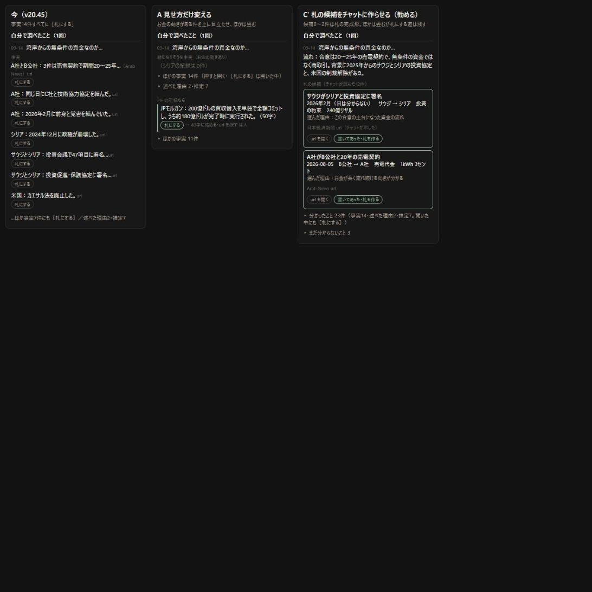

# 札にするのが面倒すぎる（質問と案）

日付：2026-09-14　元の指示書：`shiji/shiji_fuda_raku_2026-09-14.md`（質問フェーズ）
**直していない。** v20.45 のコードと、kotoba-data（読むだけ。数えた後に消した）で確かめた。

---

## 先に：答え

- **C（チャットに札の完成形を作らせる）は成り立つ。** 朝の取り込みで AI が書いた札127枚の「何が起きたか」は **17〜33字（真ん中24字）で、40字の決まりを超えそうなもの（36字以上）は0枚。** お金の動きがある88枚は全部、出す側と受け取る側が入っている。**札の形で頼めば、チャットは40字以内の文とお金の動きを書けている**（実データ）
- 今の戻した記録の事実26件は **21〜55字で、40字以内は9件だけ。** 依頼文が「1件1文・目安20〜80字」と頼んでいるため。40字に縮める手間は依頼文から生まれている
- **端末で作られた札は、まだ0枚。** 本人の「やらなそう」は当たっている
- 原則との擦れ：**Cのままだと擦れる。** 選ばれなかった件に［札にする］を出さないと、機械が選んだ結果として、人がそれを札にする道が消えるため。**選ばれなかった件も畳んだ中に残し、札にする道を残せば擦れない**（2章）
- **勧める：C'（Cに「選ばなかった件も畳んで残す」「選んだ理由を1行」「流れの要約」を足す）。人がやるのは［url を開く］と［書いてあった・札を作る］の2回**

---

## 1. C は成り立つか

### 1.1 札の形まで書かせられるか

| 材料 | 実データ |
|---|---|
| 朝の取り込み（札の形で「fact：1文・40字以内」と頼んでいる） | 127枚の文は17〜33字。40字ちょうどは0枚 |
| 同じく、お金の動き | 88枚すべて出す側・受け取る側あり、80枚に額あり |
| 戻した記録（「1件1文・目安20〜80字」と頼んでいる） | 事実26件は21〜55字。40字以内9件 |

- 朝の取り込みと同じ書き方（「40字以内。数字か固有名詞を含む」）で頼めば、書ける見込みが高い
- ただし、戻す依頼文は**長い会話の続き**に貼る。朝の取り込み（新しい会話）と同じ精度で守るかは **測れません**。守らなかったときのために、今の「40字を超えたら作れない・その場で字数を出す」は残す

### 1.2 選ばせる数

- **0〜2件**にする（1〜2件にすると、線になるものが無い会話でも無理に作る）
- **0件のとき**：「この会話から線になる動きは選ばれませんでした」の1行。分かったことは今どおり残る
- 2件を超えて書いてきたら：**落とさず全部候補にする**（黙って捨てない）。「多かった」と1行

### 1.3 選ばれなかった件を後から札にしたくなったら

**道を残す（勧める）。** 残さないと、次の2つが起きる：
- チャットが選び損ねた件（今回の PIF の記録の JPモルガン 200億ドルのような件）を、人が札にできなくなる
- 「人が押す。機械が勝手に判定しない」と擦れる（下 2.1）

残し方：分かったことは畳んで（「▸ 分かったこと 23件」）、開いた中の事実に今の［札にする］（手で入れる欄）を出す。

---

## 2. ［札にする］を出す件を絞る

### 2.1 原則との擦れ

| 決めること | 誰が | 擦れるか |
|---|---|---|
| どの動きを候補に並べるか | チャット | **提案だけなら擦れない。** 朝の取り込みでも、どの出来事を集めるかはすでに AI が選んでいる |
| 札を作るか | 人（押す） | 擦れない |
| 選ばれなかった件を札にできるか | Cのまま：できない／C'：できる | **Cのままだと擦れる。** 機械が選ばなかったことが、人の選べる範囲を狭める |
| 選んだ理由 | チャットが1行書く | 書かせると、人がその選び方に反対できる（選ばれた理由が見えないと、黙って判定されたのと同じになる） |

**答え：押すのが人でも、「選ばれなかった件は札にできない」にすると擦れる。候補として並べるだけにし、ほかの件も札にできる道を残せば擦れない。**

### 2.2 絞ると失うもの

- 選ばれなかった件が畳まれて、目に入らなくなる（開けば見える）
- チャットの選び方の癖がそのまま「先に見える線」になる（例：額の大きい動きばかり選ぶ）。**選んだ理由の1行で、人が気づけるようにする**
- 事実だけど線にならない件（「アサド政権が2024年12月に崩壊」など）は、今は［札にする］が出ていたが、畳んだ中に移る

---

## 3. 人がやることを減らす

v20.45 で1件を札にする手順と、C' での手順：

| 手順 | v20.45（今） | C' |
|---|---|---|
| 14件から選ぶ | 人 | **チャットが候補0〜2件**（人は候補を見るだけ） |
| ［札にする］を押して欄を開く | 1回 | **無し**（候補は最初から札の形で並ぶ） |
| 40字に縮める | 人が打つ（26件中17件は40字超） | **無し**（チャットが40字以内で書く。超えていたら今どおり作れない） |
| 日付（年月日／月まで）を選ぶ | 人が確かめる | 無し（チャットが書く） |
| 出す側・受け取る側・何・額を入れる | 人が打つ（シリアの記録は0件に書かれていた） | **無し**（チャットが書く） |
| 元の札とのつながり（前・後） | 人が選ぶ | チャットが書く（「前・後・無し」）。人は直せる |
| ［url を開く］ | 1回 | 1回（**減らさない**） |
| ［書いてあった］→［札を作る］ | 2回 | **1回にまとめる**：［書いてあった・札を作る］（url を開くまで押せない、は同じ） |
| 合わせて | 押す4〜5回＋打つ4〜5欄 | **押す2回・打つ0欄** |

- ［書いてあった］と［札を作る］を1つにしても、「開いてから人が押す」は同じ。**失うもの**：開いたあと、書いてあったかだけ先に押しておく（札はまだ作らない）ことができなくなる。今は使い道が無い
- 候補の欄を直したいときは［直す］で今の欄を開く。直した欄は今どおり「自分で入力」になる

---

## 4. 見せ方だけで足りるか（C と並べて比べた）



見本の中身はシリアの記録を短くしたもの。**C' の候補2件はこちらで作った見本で、チャットが本当にこう選ぶかは測れない。**

| 案 | 中身 | 手間 | 失うもの | 判断 |
|---|---|---|---|---|
| 変えない | 事実全部に［札にする］ | 押す4〜5回＋打つ4〜5欄×件数 | 何も失わないが、**作られない**（今0枚） | 反対 |
| **A 見せ方だけ** | お金の動きがある件を上に目立たせ、ほかは畳む | 目立った件は今と同じ手間 | **シリアの記録はお金の動きが0件なので、目立つ件が無い**。PIF でも JPモルガンの文は50字で、縮める手間は残る | 足りない |
| C（指示書の案） | チャットが候補1〜2件を札の形で。ほかには［札にする］を出さない | 押す2回 | 選ばれなかった件を札にできない（原則と擦れる）。0件の会話で無理に作る | 反対（C' に） |
| **C'（勧める）** | C＋候補は0〜2件＋選んだ理由1行＋流れの要約2〜3文＋分かったことは畳んで札にする道を残す | 押す2回 | 2.2・5.2 | **勧める** |
| D アプリが自動で選ぶ | お金の動きがある・金額がある件をアプリが選ぶ | 押す2回 | **機械が判定する**。シリアの記録では0件。反対 | 反対 |

---

## 5. C' の中身（案）

### 5.1 まとめの依頼文に足す節

```
■ 札の候補（cards）
この会話で分かったことのうち、地図の線になる動き（お金・物・人が、誰から誰へ動いたか）を 0〜2件選ぶ。
線になる動きが無ければ空の配列。無理に選ばない。
- fact：1文・40字以内。数字か固有名詞を含む。
- eventDate：YYYY-MM-DD。日が分からなければ YYYY-MM。日を作らない。
- flow：from・to は必須。what・amount は出典の書き方のまま。
- url：この会話で出典として示された url のうち、この動きが書いてあるページ。無ければこの件を選ばない。
- source：媒体名と日付。
- rel：元の札の動きの前（before）・後（after）・どちらでもない（""）。
- why：なぜこの動きを選んだか。1文。
- 札に元から書いてあった動きは選ばない。

■ 流れ（story）
この会話で何を調べて、何が分かったかを 2〜3文。推測は「〜と見られる」と分かる形で。
```

- url の無い動きは候補にしない（「url が無い値は取り込まない」を依頼文の段階で守る）
- 字数の見込み：依頼文が約1,643字 → 約2,100字（**本物で数えるのは実装のとき**）

### 5.2 失うもの

- 依頼文が長くなる
- 候補は**チャットが選んだもの**。選び方の癖が、先に見える線になる（理由の1行で見えるようにする）
- 「流れ」は要約なので、元の会話にあった言い回し・細部が落ちる（分かったこと23件は今どおり残す）
- 候補の値は全部「チャット」。人が直さない限り「自分で入力」は付かない（今の決まりのまま）

### 5.3 記録の見え方

```
自分で調べたこと（1回）
 09-14　湾岸からの無条件の資金なのか…
 流れ：…（2〜3文）
 札の候補（チャットが選んだ・2件）
  ┌ サウジがシリアと投資協定に署名
  │ 2026年2月（日は分からない）　サウジ → シリア　投資の約束　240億リヤル
  │ 選んだ理由：…
  │ 日本経済新聞 url（チャットが示した）
  │ ［url を開く］［書いてあった・札を作る］［直す］
  └
 ▸ 分かったこと 23件（開いた中の事実にも［札にする］）
 ▸ まだ分からないこと 3件
```

候補が0件：「この会話から線になる動きは選ばれませんでした（分かったことから手で札にできます）」。

---

## 決めてほしいこと

1. **C' でよいか**（候補0〜2件・選んだ理由・流れの要約・分かったことは畳んで札にする道を残す）
2. **［書いてあった］と［札を作る］を1つのボタンにまとめてよいか**（url を開くまで押せない、は同じ）
3. すでに戻した PIF・シリアの記録（候補が無い）は、今の形（分かったことに［札にする］）のままでよいか。候補を作り直したいときは、そのチャットの続きにもう一度まとめの依頼文を貼る
