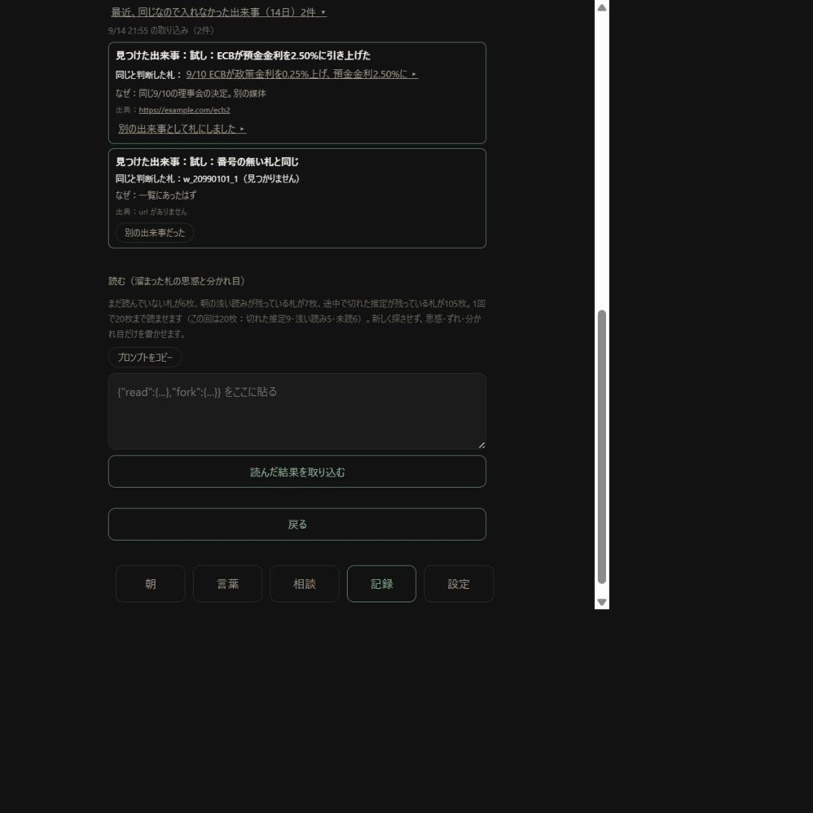

# v20.48 重複 段1（すでにある札の一覧と same・follows）公開

日付：2026-09-14　仕様書：[`spec/sekai_juufuku_dan1.md`](../spec/sekai_juufuku_dan1.md)　元の回答書：`shiji/kaitou_juufuku_2026-09-14.md`

## やったこと

- 朝の取り込みのプロンプトの末尾に「すでにある札」の一覧を足した（取り込んだ日が直近14日・上限100件・新しい順。「最近のお金の動き」に出ている札は重ねない。非表示・初期投入・自分で作った札も含む）。日数と件数は1か所の定数
- プロンプトに「すでにある札との関係（same・follows）」の規則を足した。同じ出来事は札にせず `same` に、続報は新しい札にして `follows` に前の札の番号
- コピーするとき、一覧に入る札がありそうな月を先に読み込む。コピーの文に「すでにある札 91件を渡しました」、上限で外れたら件数、読み込めなかった月があれば月の名前を出す
- 取り込みの結果に「同じなので入れなかった N件」「うち N件は同じと判断した札が見つかりません」「続報として前の札を指した N件」「続報の前の札が見つからなかった N件（札は作りました）」。JSON に same が無ければ「同じ出来事の報告なし」
- 結果の下の［同じなので入れなかった N件 ▸］で中身が開く。見つけた出来事・同じと判断した札（押すと開く）・なぜ・出典
- 取り込む画面に「最近、同じなので入れなかった出来事（14日）N件 ▸」。結果の文が消えたあとも、取り込みごとに読める
- 各件に［別の出来事だった］。押すと記録に日時が残り、その場に札を作る欄が開く（v20.46 と同じ：日付とお金の動きを入れ、［url を開く］→［書いてあった・札を作る］）。作った札には「『同じ』とされたが別の出来事として作った札（比べた札：…）」と出る
- 札を開くと「続報の前の札：… ▸」「この後の続報 N枚 ▸」
- 記録は調べたことの月ファイルの `imports`。**この月ファイルの知らない欄を、落とさず残すようにした**（次の段で欄を足しても v20.48 以降の端末は消さない）
- プロンプトが長いときの注意の境目を 23,000字 → 30,000字にした（一覧を足したので毎回注意が出るようになるため）

（偽の GitHub に 9/13 の実データの写しを置き、試しの JSON で取り込んだ画面。1件目は［別の出来事だった］から札にした後、2件目は一覧に無い番号を書いてきた件）

## 実測

### プロンプトの伸び

同じ実データの写しで、取り込む画面の［プロンプトをコピー］を本当に押して、コピーされた文を数えた（数字と決算の節は、試しの画面では通信できず入らない）。

| | 字数 |
|---|---|
| v20.47 | 20,503字 |
| v20.48 | 25,112字 |
| 増えた分 | **4,609字（22%）** |
| 内訳：すでにある札の一覧 | 3,986字（91件） |
| 内訳：規則の節 | 473字 |
| 内訳：出力形式の例と決まりの行 | 150字 |

仕様書の見込み（約5,000字）より少し少ない。9/13 の写しなので札が91件（上限の100件に届かず、外れた札は0件）。

### 取り込み（偽の GitHub・本当に押した）

- same 2件（1件は正しい番号、1件は無い番号）・続報2件（1件は正しい番号、1件は無い番号）・今日見るべき件0件の JSON を貼って［取り込む］
  - 結果：「2件を入れました。今日見るべき件：0件…。同じなので入れなかった 2件…。うち 1件は同じと判断した札が見つかりません。続報として前の札を指した 1件。続報の前の札が見つからなかった 1件（札は作りました）」
  - ［同じなので入れなかった 2件 ▸］で中身が開き、「同じと判断した札」を押すとその札が開いた
- ［別の出来事だった］→ 札を作る欄で日付（2026-09-10）と出す側を打ち込み →［url を開く］→［書いてあった・札を作る］
  - 1回目は「似た札がもうあります：9/10 ECBが預金金利を2.50%に引き上げた（作りませんでした）」と出て作られなかった（写しの中に同じ文の札があり、今の重複弾きが止めた。画面に理由が出た）
  - 何が起きたかを別の文に打ち直して押すと、札ができた。記録に「別の出来事だった」の日時・作った札の番号・開いて確かめた url が残った
- 続報の札を開くと「続報の前の札：9/10 フーシ派が紅海の港町モカを制圧した ▸」、元の札を開くと「この後の続報 1枚 ▸」、押すと並べて出た
- 画面のエラーは0件

### 2台

- 端末Bで同期 → 取り込む画面の「最近、同じなので入れなかった出来事（14日）2件」に、端末Aと同じ中身（1件目は「別の出来事として札にしました ▸」）。続報の印も同じ

### 古い版（v20.47）の端末が書き直したとき

- **実際に消えた。** v20.47 のページで［Claude に聞く］を押して同期すると、月ファイルから `imports` が無くなった
- そのあと v20.48 の端末が同期すると、手元の記録を**書き戻した**（聞いた記録も残った）
- v20.47 の今日見るべき件のときと同じ。両端末を v20.48 にしてから朝の取り込みを流してほしい

### 手元の試し

- 31項目（一覧の14日の境目・100件の上限と外れた件数・お金の動きと重ねない・非表示と初期投入を含む／same 5件：正しい番号・無い番号・番号なし・長い理由を切って印・安全でない url・文字だけの件／follows：正しい・無い番号・#番号・自分自身／記録の保存と読み直し・2台の合わせ方・［別の出来事だった］の日時の合わせ方・知らない欄を残す）すべて通った
- 前の版までの試し 104項目も通った

### 決まった8項目（本当に押す・打つ）

| # | 項目 | 結果 |
|---|---|---|
| 1 | 言葉の一覧の検索に「世界」 | 入った |
| 2 | 世界の検索に「原油」 | 入った |
| 3 | 概念の一覧の検索に「金利」 | 入った |
| 4 | お金の一覧の検索に「米国」 | 入った |
| 5 | 問いの欄に「なぜ石油」 | 入った |
| 6 | 地図の［米州］・［お金］ | 選ばれた（29件・24件） |
| 7 | 地図の下の［場所不明 5件］→ 一覧 →［← 戻る］ | 地図に戻った |
| 8 | 札を開いて［詳しく］ | 出典の url が出た |

触った欄：札を作る欄の日付・出す側・何が起きたかにも打ち込んだ（入った）。

## 失うもの

- 朝のプロンプトが約4,600字（22%）長くなった
- チャットの「同じ」が間違っていれば、その出来事は札にならない（中身は結果の下と取り込む画面に出る）
- ［別の出来事だった］から札を作るには、出す側か受け取る側を入れる必要がある（v20.46 の［札にする］と同じ決まり。お金の動きの無い出来事は、そのままでは札にできない）
- 一覧は14日・100件まで
- v20.47 以前の端末が月ファイルを書き直すと記録が消える（v20.48 の端末が持っていれば書き戻す）

## 測れないこと

- チャットが本当に「同じ」を正しく判断するか、「見えていたのに重複した6枚」の形が止まるか → 段1を何回か流したあと、kotoba-data を読むだけで数えて報告する（回答書の3点）
- iPhone の幅での見え方

## お願い

1. 両端末を v20.48 にする（設定 → 世界 の一番下）
2. 朝の取り込みを何回か流して、結果の「同じなので入れなかった N件 ▸」を開き、本当に同じだったかを見る。違っていたら［別の出来事だった］を押す
3. 何回か流したら知らせてほしい。重複の数え直しをする
