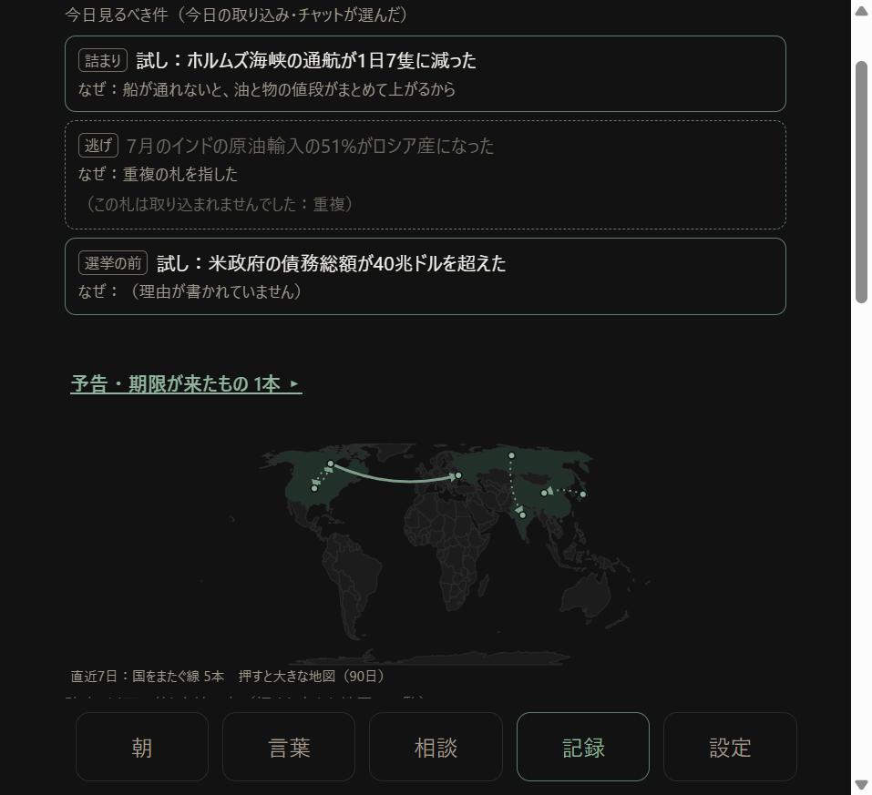

# v20.47 今日見るべき3件 公開

日付：2026-09-14　仕様書：[`spec/sekai_kyou3.md`](../spec/sekai_kyou3.md)　元の回答書：`shiji/kaitou_omomi_2026-09-14.md`

## やったこと

- 朝の取り込みのプロンプトに「今日見るべき件（today）」の節を足した（0〜3件・#番号・5つの型か10字以内の自分の言葉・理由60字・専門用語なし）。初期投入のプロンプトには付けていない
- 取り込みで `today` を読み、#番号を取り込んだ札に結びつけて記録する。落ちた札を指していても、文と落ちた理由（重複・URL なし など）を残す。3件を超えても全部残す
- 記録は調べたことの月ファイル（`world/dig/YYYY-MM.json`）の `picks` に置き、2台で合わせる
- 世界の画面の一番上（予告の行の上）に出す。押すと札が開く。落ちた札の件は点線の枠・薄い字で押せない
- 取り込みの結果の1行に「今日見るべき件：3件」「0件（チャットが選びませんでした）」「うち1件は札が取り込まれませんでした（重複）」を足した

（偽の GitHub に 9/13 の実データの写しを置き、試しの札で取り込んだ画面。2件目は重複で落ちた札を指した件、3件目は5つの型に当たらず自分の言葉「選挙の前」、理由が空の件）

## 実測

### プロンプトの伸び（回答書の確かめ方）

同じ実データの写しで、v20.46 と v20.47 の朝の取り込みのプロンプトを並べて比べた。

| | 字数 |
|---|---|
| v20.46 | 20,034字 |
| v20.47 | 20,503字 |
| 増えた分 | **469字（2.3%）**。仕様書の見込みは約600字 |

増えた行は、足した節・出力形式の例1行・「今日見るべきものが無いとき」の1行だけ（ほかの行は1行も変わっていない）。

### 3件が選ばれなかった日（回答書の確かめ方）

- `"today": []` の JSON を取り込む → 結果の1行「今日見るべき件：0件（チャットが選びませんでした）」、画面の一番上「今日の取り込みでは、見るべき件は選ばれませんでした（材料が少ない日）」
- `today` が書かれていない JSON（前の形）→ 記録を作らず、結果の1行にも何も足さない。画面は前の記録のまま
- 今日の取り込みが無い日 → 直近の分を「9/12 の取り込み」と日付つきで出す。7日前（9/7）までは出て、8日前（9/6）だけなら何も出さない

### 2台

- 端末Aで3件つきの JSON を取り込む → 自動の同期で偽の GitHub の月ファイルに picks が入った
- 端末B（別の保存場所）を開く → 同期で同じ3件が一番上に出た
- 端末Bで0件の JSON を取り込む → 端末Aを同期すると記録は2つとも残り、一番上は新しい方（0件）

### 古い版の端末（v20.46）が書き直したとき

- **実際に消えた。** v20.46 のページで［Claude に聞く］を押して同期すると、月ファイルから picks が丸ごと無くなった（聞いた記録は入った）
- ただし、その後 v20.47 の端末Aが同期すると、手元に持っていた2つの記録を**書き戻した**（聞いた記録も残った）
- つまり、消えたままになるのは「v20.47 の端末がどれも、その記録を持っていないとき」。両端末を v20.47 にしてから朝の取り込みを流してほしいのは変わらない

### 手元の試し

- 取り込みと記録：25項目（3件／0件／5件／#番号が範囲の外／重複で落ちた札／自分の言葉の型／長い型と理由を切って印／理由が空／2台の合わせ方／古い形の文書／表示の決め方／月をまたぐ）すべて通った
- 前の版までの調べたことの試し 79項目も通った
- 初期投入（米州）のプロンプトに今日見るべき件が入らないこと、初期投入の JSON に today を書いても記録しないことを確かめた

### 決まった8項目（本当に押す・打つ）

| # | 項目 | 結果 |
|---|---|---|
| 1 | 言葉の一覧の検索に「世界」と打つ | 入った・欄はそのまま |
| 2 | 世界の検索に「原油」 | 入った |
| 3 | 概念の一覧の検索に「金利」 | 入った |
| 4 | お金の一覧の検索に「米国」 | 入った |
| 5 | 問いの欄に「なぜ石油」 | 入った |
| 6 | 地図の地域［米州］・種類［お金］を押す | 選ばれた（29件・24件） |
| 7 | 地図の下の［場所不明 4件］→ 一覧 → ［← 戻る］ | 地図に戻った |
| 8 | 札を開いて［詳しく］ | 出典・確度・url が出た |

画面のエラーは0件。今日見るべき件の1件目を押すと、その札が開いた。落ちた札の件を押しても何も起きなかった。

## 失うもの（仕様書のとおり）

- プロンプトが469字長くなった
- チャットの選び方の癖が一番上に出る
- 3件に入った札は、上と下で2回見える
- 「dig」の月ファイルに朝の3件も入る
- v20.46 以前の端末が書き直すと、記録が消える（新しい版の端末が持っていれば書き戻す）

## 測れないこと

- チャットが本当に見るべき3件を選ぶか、理由が読めるか → **本人が端末で朝の取り込みを流して確かめてほしい**
- 材料が少ない本物の日に、チャットが0件を返すか
- iPhone の幅での見え方（パソコンの画面で見た。枠は横いっぱいで、文は折り返す作り）

## お願い

1. 両端末を v20.47 にする（設定 → 世界 の一番下）
2. 朝の取り込みを流して、世界の画面の一番上に出るか・理由が読めるかを見る
