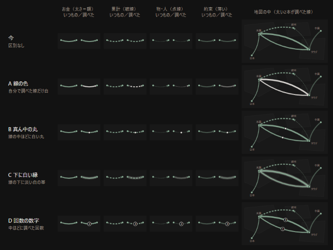

# 自分で調べたことを札に戻す（質問と案）

日付：2026-09-14　元の指示書：`shiji/shiji_nodo_2026-09-14.md`（質問フェーズ）
**直していない。** v20.42 のコードと、kotoba-data（読むだけ。数えた後に消した）で確かめた。

---

## 先に：分かったこと

- **［Claude に聞く］は、依頼文をコピーするだけ。** 押した記録は何も残らない。返事が戻る道も無い
- **「読んだ」の印（readAt）は、127枚すべてに付いている。** これは機械の「読む回」が付けた印で、人が見た印ではない。だから PIF の札は、本人が調べた後も、ほかの札と区別がつかない
- **★（刺さった）は0枚。** 札に手で押す印はすでにあるが、使われていない
- **「返事を JSON で貼り戻す」道は、すでに「問い」が持っている。** 問い2本から札8枚が入っている。これを土台にできる
- **地図の線は、太さ・破線・点線・薄さですでに4つの意味を使っている。** 黄色は「推定」の色。自分で調べた線は、これらとぶつからない描き方が要る（絵で見比べた。4章）

**勧める最初の段：札の上の［調べたことを戻す］で、同じチャットにまとめ方をコピーし、返ってきた JSON を貼ると、札の下に「自分で調べたこと」として残る。新しい札・線はまだ作らない。**

---

## 1. 今の［Claude に聞く］

### 1.1 押したときに渡しているもの

札を開いて［Claude に聞く］を押すと、依頼が4つ並ぶ（やさしく説明／なぜ今なのか／日本にどう効くか／反対の見方は）。どれかを押すと、次をまとめてコピーする。

| 入れているもの | 中身 |
|---|---|
| 出来事 | 日付と、何が起きたか |
| なぜ今動いたか | 札の「なぜ」 |
| 前提 | 札の前提（概念の名前と1行） |
| 動かした側 | 主体ごとの「した事」「述べた理由（無ければ無いと書く）」「推定」、お金の動きとドル換算 |
| 乗っている量 | 地層の名前・1行・今の値 |
| 私が既に知っていること | 用語の注と、出典が欲しがっているもの（「反対の見方は」のときだけ） |
| 詳細・出典・確度・url | 札のまま |
| 見立て・自分の予測 | 札に付いていれば |
| 依頼文 | 字数の上限（300字、反対の見方は400字）と、「出典のある事実と推測を分ける」「見出しを使わない」などの決まり |

**入っていないもの：** つながる札（同じ概念に触れている札）、お金の鎖（この動きの前後）、その主体のほかの札。

概念・用語・主体の画面の［Claude に聞く］も、同じくコピーするだけ。

### 1.2 返事はどこに行くか

**どこにも行かない。** コピーしたことを1行出すだけ（「コピーしました。Claude のチャットに貼ってください」）。チャットの返事をアプリに戻す欄は無い。

### 1.3 押したことは記録されているか

**記録されていない。** どの札で、いつ、何回押したかは、端末にも GitHub にも残らない。

### 1.4 本物のデータ（2026-09-14）

| 項目 | 数 |
|---|---|
| 札 | 127枚（非表示0） |
| うちお金・物・人の動きがある | 88枚 |
| url がある | 127枚（url の無い札は1枚も無い） |
| 読む回の印（readAt） | 127枚 |
| ★（刺さった） | **0枚** |
| 問いから入った札 | 8枚（問い2本） |
| 「つながる札」の欄（related）に番号がある | 0枚 |
| 主体 | 90件（JPモルガンは無い） |
| 予告 | 33本、概念 44件 |

PIF の札：`w_20260804_2`「サウジ政府系ファンドが550億ドルでEAを買収完了」、お金の動き「PIF・シルバーレイク・アフィニティ → EAの株主 550億ドル」、出典は EA の発表、確度8、主体は PIF だけ。

---

## 2. 調べた内容を戻す道

### 2.1 今の取り込む回・読む回と同じ形でできるか

**できる。** ただし1つ違う所がある。

- 取り込む回・読む回・問いは、**アプリが作ったプロンプトを新しいチャットに貼る**。返事はそのプロンプトに書いた JSON の形で来る
- 調べた内容は、**本人が続けて質問したチャットの中にある**。後から JSON だけを頼むには、**そのチャットの続きに「ここまでに分かったことを、この形でまとめて」と貼る**必要がある

流れの案：

1. 札の［調べたことを戻す］を押す → まとめ方の依頼文がコピーされる（札の番号が入っている）
2. 調べていたチャットに貼る → JSON が返ってくる
3. 札の［調べたことを戻す］の欄に貼って［取り込む］を押す

本人がするのは、押す・貼る・押すの3つ。どの札の話かは番号で決まるので、選ぶ手間は無い。

**確かめられないこと：** 長い会話のあとで、チャットが事実と推測を正しく分けて JSON にできるか。url を作り話にしないか。**実際にやってみないと測れません。** だから最初の段では、貼ったものを札や線にせず、見えるように残すだけにする（2.3）。

### 2.2 戻すもの

PIF の例で、何が要るかを並べた。

| 戻すもの | 例 | 要るか | いつ |
|---|---|---|---|
| 分かったこと（事実・述べた理由・推定） | 「JPモルガンが200億ドルを出した」「米国は情報流出を恐れている」 | **要る。一番小さくて価値がある** | 第1段 |
| 自分の問い（何が気になったか） | 「なぜサウジが米国のゲーム会社を買うのか」 | 要る（後から読み返すとき、何を掘ったかが分かる） | 第1段 |
| 新しい札 | 「JPモルガンが PIF に200億ドルを融資」 | 要る。ただし出典がある事実だけ | 第2段 |
| 新しい線 | JPモルガン → PIF | 新しい札のお金の動きとして作る（線だけを作る器は無い） | 第2段 |
| 主体の追加 | JPモルガン、業務改善に強い投資会社 | 新しい札を取り込むと、今の仕組みで自動で足される | 第2段 |
| 既存の札への追記 | PIF の札の「動かした側」に JPモルガンを足す | **反対。** AI が集めた札の中身と、自分で調べた中身が混ざる。札は変えず、横に「自分で調べたこと」を置く | — |

### 2.3 出典（url）が無いもの

今の決まり：**url が無い値は札にしない**（取り込みで落とす）。127枚すべてに url がある。

自分で調べた内容は、出典があいまいなものが多い。案は3つ。

| 案 | 中身 | 失うもの |
|---|---|---|
| **1 札にしない・記録には残す（勧める）** | url の無いものは「自分で調べたこと」の記録にだけ残す。札・線・プロンプトには入れない。札の下に「出典なし」と添えて見せる | url の無い発見は、地図の線にならない。ほかの札とつながるのは、記録の中の言葉からだけ |
| 2 url が無くても札にする | 「自分で調べた・出典なし」の印を付けて札にする | **反対。** 地図の線・取り込む回・読む回の材料に、確かめていない数字が入る。今は「事実は出典つき」で揃っているのが崩れる |
| 3 url が付いたら札にできる | 案1で残したものに、後から url を足せば、第2段で札にできる | 足す手間は人に残る（ただし押すのは1回） |

**勧める：案1＋案3。** 事実と推定を混ぜない原則と、黙って捨てない原則の両方を守れる。**url が無いからといって捨てない。見えるように残して、線にだけしない。**

### 2.4 「自分で調べた」の印と、did／said／read／予告の関係

今の札の「動かした側」には、主体ごとに3つの欄がある：した事（did）・述べた理由（said）・推定（read）。

**同じ3つの分け方を、自分で調べたことにも使う。そのうえで、誰が書いたかを別に持つ。**

| 分けるもの | 今（AI が集めた） | 足す（自分で調べた） |
|---|---|---|
| した事 | did（出典つき） | 事実（出典つき、無ければ「出典なし」） |
| 述べた理由 | said（出典つき） | 述べた理由（出典つき、無ければ「出典なし」） |
| 推定 | read（黄色） | 推定（同じ黄色） |
| 予告 | 予告の画面 | 第1段では作らない（自分で調べた中から予告を立てるのは第3段以降） |
| 誰が | 生成（書いた回：朝・読む回・問い） | **自分**（戻した日時・チャットで何を聞いたか） |

- 推定は、誰が書いても推定の色（黄色）。「自分で調べた」でも事実にはしない
- 「自分で調べた」は、1件ごとの欄ではなく、**記録のファイルに入っていること**そのものが印になる（札の中身は変えない）

### 2.5 既存の札とのつながり

| つながり方 | 今の仕組み | 第何段 |
|---|---|---|
| 調べた元の札 | 記録に元の札の番号を持つ。札を開くと下に出る | 第1段 |
| 同じ主体 | 記録に出てくる主体の名前が、主体の一覧にあれば、主体の画面の時系列に「自分で調べた」の行を出す | 第2段 |
| 同じ概念（つながる札） | 今は札の「概念」で結ぶ。記録から作った札も概念を持てば、今の仕組みにそのまま乗る | 第2段 |
| お金の鎖（前後の動き） | 札のお金の動きに「どの動きの続きか」がある。JPモルガン → PIF は PIF → EA の前の動き。**元の札を書き換えずに**、記録の側に「この札の前の動き」を持ち、鎖を作るときに読む | 第2段 |

---

## 3. 印と重み

### 3.1 自動で残せるか

| 印 | 自動で残せるか | 案 |
|---|---|---|
| Claude に聞いた | **残せる**（依頼を押してコピーした時点） | 札・依頼の種類・日時を記録。第1段 |
| 貼り戻した | **残せる**（取り込んだ時点） | 記録そのもの。第1段 |
| 読んだ | 札を開いた・詳しくを押した、は残せる。**でも「開いた」は「読んだ」ではない** | **作らない。** 開いた回数を重みにすると、押し間違いも重みになる。「調べた」「戻した」が本当の印 |
| 理解した | 自動では決められない | 下の 3.2 |

人が手で押すべきものは、**［調べたことを戻す］と［取り込む］だけ**。印のために押すボタンは足さない。

### 3.2 理解度

**要らない。** 理由：

- ★（刺さった）は手で押す印だが、127枚のうち**0枚**。手で付ける評価は、続かない見込みが高い（実データ）
- 理解したかどうかは、**戻したものの中身**（事実を何件、推定を何件、どの主体まで辿ったか）に出る。数えられるので、段階を自分で付ける必要がない
- 段階を付けると、付けていない札が「理解していない」に見える

### 3.3 重み（どのお金の流れを先に見るか）

**深さの数え方（案）：** 札ごと・主体ごとに、

- 戻した回数
- 戻した事実のうち出典つきの件数
- そこから生まれた札の数（第2段から）

を数える。**保存せず、記録から毎回数える**（数え方を後で変えても、古い記録で数え直せる）。

**使い道（案。どれを使うか決めてほしい）：**

| 使い道 | 中身 | 失うもの |
|---|---|---|
| ア 取り込む回で続きを集める | 朝のプロンプトに「私が掘っている主体と流れ」を並べ、続報を優先させる | **掘った所ばかり集まる。** 見ていない所（尺度5「静けさ」）がさらに見えなくなる。**使うなら、枠の上限を決める**（例：朝の件数の3割まで） |
| イ 地図・お金の一覧で先に出す | 掘った線を上に並べる・描き分ける | 同じ組に線が多いとき「太い順に5本」を崩す |
| ウ 続きが来たら知らせる | 新しい札が、掘った主体・流れに触れたら、ホームの世界の行に「続きが来た」 | ほぼ無い（普段は出ない） |

**勧める順番：ウ → イ → ア。** アは効き目が一番大きいが、偏りも一番大きいので最後。

### 3.4 別のファイルに置く

データ量の調査で決めたとおり、**札の中には入れない。**

- 置き場所：`world/dig/YYYY-MM.json`（**戻した月**ごと。札の日付の月ではない。古い月のファイルが後から書き換わらない）
- 中身：
  - 聞いた記録：札の番号・依頼の種類・日時
  - 戻した記録：札の番号・日時・自分の問い・分かったこと（事実・述べた理由・推定、それぞれ出典があれば url）・出てきた主体の名前・お金の動き
- 足すだけ。消すときは消した印を残す（ほかのファイルと同じ合わせ方）
- 索引（world/index.json）に月ごとの更新日時を足す。**今までの月ファイルと同じ仕組み**なので、2台で合わせる方法は新しく作らない
- 大きさの見込み：戻した記録1件で約1〜3KB（字数からの見込み）。1日1件で1か月約90KB、1万日で約10〜30MB（330ファイルに分かれる）。**1件の大きさは、やってみないと測れません**

---

## 4. 見え方

### 4.1 地図の線（絵にして見比べた）

今の線の決まり：太さ＝額（ドル換算の5段）、破線＝累計、点線＝物・人・換算できない、薄い・白抜きの矢印＝約束。色は緑1色。黄色は推定の色、赤は警告の色。

見本の作り方：地図と同じ色・太さ・破線の決まりで、線の4種類それぞれに「いつもの線」と「調べた線」を並べ、右に地図の中の見え方（太い2本が調べた線）を描いた。**本物の地図ではない**（本物の地図で見るのは、線を作る第3段）。

| 候補 | 見えたこと |
|---|---|
| A 線の色（白） | 一番見分けやすい。4種類ともぶつからない。約束の線は薄い白（灰色）に見えるが、約束だとは読める |
| B 真ん中の白い丸 | 太い線の上では小さくて見落とす。点線の上では点の模様に紛れる |
| C 下に白い縁 | 線が太って見え、額の太さと取り違えやすい。点線・約束の線では灰色の帯になり、元の種類が読みにくい |
| D 回数の数字 | 深さまで分かるが、線が多い所で重なる。数字が小さく、iPhone では読めない見込み |

**勧める：A（線を白にする）。** 深さ（回数）は地図ではなく、線を押して出る一覧に書く。

失うもの：白い線が増えると、地図の中で白が目立ちすぎる。掘った線が10本を超えたらどう見えるかは、**今は測れません**（掘った線がまだ0本）。

### 4.2 何を掘ったかを後から読み返す

- **札を開くと、下に「自分で調べたこと」**（戻した日・自分の問い・事実・述べた理由・推定。出典の無いものは「出典なし」）
- **世界の画面に「調べたこと」の一覧**（戻した新しい順。押すと元の札を開く）
- **主体の画面の時系列に「自分で調べた」の行**（第2段）

---

## 5. 段の分け方（案）

| 段 | 中身 | 価値 |
|---|---|---|
| **第1段** | ［Claude に聞く］を押したら記録する。札に［調べたことを戻す］：まとめ方の依頼文をコピー → JSON を貼る → 記録のファイルに残し、札の下に出す。url の無いものも残す（札にはしない）。世界の画面に「調べたこと」の一覧 | **調べたことが消えない。** 何を掘ったかが読み返せる。どの札を調べたかが分かる |
| 第2段 | 記録のうち、出典つきのお金の動きを、自分で調べた印つきの新しい札にする（人が押す）。主体を足す。お金の鎖・主体の時系列につなぐ | 能動的な線ができる。ほかの札とつながる |
| 第3段 | 地図で調べた線を白く描く（本物の地図で見比べてから決める）。続きが来たらホームに知らせる（ウ） | 地図で自分の線が見える |
| 第4段 | 深さの重みを、地図の並び（イ）と朝の取り込む回（ア、上限つき）に使う | どの流れを先に見るかに効く |

**第1段で失うもの：** 札の画面にボタンが1つ増える。GitHub に月ごとのファイルが1種類増える。

---

## 決めてほしいこと

1. **戻し方：** 調べていたチャットの続きに「まとめて」の依頼文を貼り、返ってきた JSON を札に貼る、でよいか（チャットの文章をそのまま貼って、アプリが事実と推定を分ける案もあるが、**反対**。機械が勝手に判定することになり、崩れても気づけない）
2. **出典の無いもの：** 案1＋案3（札にはしない・記録には「出典なし」で残す・url が付いたら札にできる）でよいか
3. **最初の段：** 札の下に「自分で調べたこと」として残すだけ（新しい札・線は第2段）でよいか
4. **理解度：** 作らない、でよいか。「読んだ」の印も作らない、でよいか
5. **★（刺さった）：** 残すか。役割は「調べた」と近いが、調べるほどではないが刺さった札に使える
6. **重みの使い道：** ウ（続きが来たら知らせる）→ イ（地図で先に）→ ア（朝の取り込みで続きを集める。上限つき）の順でよいか。アの上限をどれくらいにするか
7. **地図の見え方：** A（線を白くする）を第3段で本物の地図に当てて見比べる、でよいか

## 確かめた所

- コード：［Claude に聞く］の依頼文の組み立てとボタン（コピーするだけ・記録なし）、概念・主体の［Claude に聞く］、問いのプロンプトと取り込み（行動 → 札、主体 → 問いの回、関係する札の番号）、札の取り込み（url が無ければ落とす）、お金の鎖（続きの番号で辿る）、地図の線の描き方
- 本物のデータ（kotoba-data を読むだけ。数えた後に消した）：札・主体・問い・予告・概念の数、印の付き方、PIF の札の中身、JPモルガンの有無
- 見え方：地図と同じ色と線の決まりで描いた見本（`img/2026-09-14_nodo_sen.png`）
