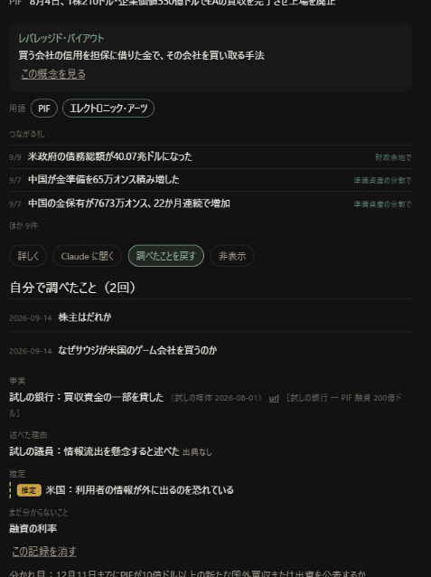

# 自分で調べたことを札に戻す：第1段（v20.43）

日付：2026-09-14　仕様書：[`spec/sekai_nodo.md`](../spec/sekai_nodo.md)
公開：v20.43（GitHub Pages で新しい版が出ていることを確かめた）

## したこと

- **［Claude に聞く］の依頼を押してコピーできたら、聞いた記録を残す**（札の4つ、概念・用語・主体の画面の依頼も）
- **札に［調べたことを戻す］**：［まとめ方をコピー］→ 調べていたチャットの続きに貼る → 返ってきた JSON を貼って［この札に取り込む］
- **札の下に「自分で調べたこと（N回）」**：新しい順。事実・述べた理由・推定（黄色）・種類なし・まだ分からないこと。出典の無いものは「出典なし」。url や日付の形が正しくない・長くて切った・種類が書かれていなかった、は赤い小さな字で添える。［この記録を消す］
- **札の一覧の右端に「調べた」**（白い小さな字）
- **世界の画面に「調べたこと N件 ▸」**（1件も無いときは出さない）。押すと一覧、押すと元の札を開き、戻ると一覧に戻る
- 記録は `world/dig/YYYY-MM.json` と `world/dig/index.json`。札・線・プロンプトには入れない

## 仕様書から変えた・足した所（どれも小さく、賛成なので入れた）

| 何を | なぜ |
|---|---|
| 札の中の取り込むボタンを「この札に取り込む」にした | 世界の画面の上に「取り込む」（取り込む画面へ移るリンク）があり、同じ名前だと押し間違える（試しで実際に間違えた） |
| **同期のあと画面を描き直しても、開いていた札を開いたままにした** | 前から、同期のたびに開いていた札が閉じていた。聞いた記録・戻した記録を残すと同期が起きるので、押した1秒後に札が閉じて、取り込んだ結果が見えなくなった（試しで起きた） |
| 自分で書いた記録を送っただけの同期では、画面を描き直さない | 同上。ほかの端末から新しい記録が来たときだけ描き直す |
| まとめ方の依頼文に「text は1件1文、目安20〜80字」「flow が無ければ null」「open が無ければ []」を足した | 返ってくる形をそろえるため。字数は988字（見込み約1,000字） |

## 確かめたこと

**手元の試し（27通り、全部通った）**
- 正しい JSON：事実1・述べた理由1・推定1・種類なし2。種類が「fact」の件と、文字だけの件は「種類なし」で残った。推定に url があっても推定のまま
- 同じまとめを2回 → 取り込まない。別の札の番号 → 取り込まない。番号なし → この札
- url が「ロイター」→ 出典なし（元の文字を残す）。「reuters.com/x」→ https を付ける。javascript: やホストに「.」の無い url → 出典なし。日付「9月29日」→ 元の文字を残す
- 350字の文 → 300字で切って印。56件 → 全部残して「多かった」と1行
- JSON でない・中身が空 → 理由を出す。コードの囲み付き → 読める
- 合わせ方：2台で別々に戻す・聞く → 両方残る（どちらから合わせても同じ）。片方で消す → 戻らない。同じ番号で中身が違う → ぶつかった記録に残る
- 10/1 に戻すと 2026-10 のファイルに入る（戻した日の月）

**偽の GitHub と2台に見立てたブラウザ（試し用のデータ：9/13 に手元に写したもの。本物の GitHub には触っていない）**

| 操作 | 結果 |
|---|---|
| 端末Aで PIF の札の［Claude に聞く］→ 依頼を押す | 聞いた記録が GitHub に入った（3件） |
| ［まとめ方をコピー］ | 988字の依頼文がコピーされた（札の番号入り） |
| **本物のキーで JSON（385字）を打つ** | 全部入った |
| 取り込む前に同期して画面を描き直す → 札を開き直す | 貼った385字が欄に戻っていた |
| ［この札に取り込む］ | 札の下に出た。一覧に「調べた」。4秒後の同期のあとも札は開いたまま |
| 端末Bを開く | 「調べたこと 2件 ▸」→ 一覧 → 札を開くと同じ内容 → 戻ると一覧 |
| 端末Bで［この記録を消す］→ 端末Aで同期 | 端末Aからも消え、戻ってこない |
| 何もしない同期を2台で6回 | 記録の索引の読み込み6回（1回の同期につき1回）、**記録のファイルへの書き込み0回** |
| 取り込む回・読む回・問い・答え合わせ・［Claude に聞く］のプロンプト | 戻した文が1つも入っていない。取り込む回・問い・答え合わせ・聞くの字数は取り込む前と同じ |
| 札の数・お金の動きの数・主体 | 変わらない（戻した記録の主体「試しの銀行」などは主体の一覧に入っていない） |

**決まった8項目**：言葉の一覧・世界・概念・お金の一覧・問いの欄に本物のキーで2文字以上打って全部入った。地図の地域（アジア）・種類（お金）、「場所不明 4件」から一覧へ行って戻る、札を開いて「詳しく」、も動いた。新しい貼る欄にも本物のキーで「貼る欄の確かめ」と打って入った。エラー0。

## 確かめられなかったこと

- **2回目の JSON を本物のキーで打つ確かめ**：途中から、ブラウザを操作する道具が英数字と記号を打てなくなった（何も無いページの入力欄でも英数字だけが入らない。日本語は入る）。アプリの問題ではない。2回目以降は、欄に文字を入れて入力の知らせを起こす形で確かめた
- **本物のチャットが、この依頼文で正しい JSON を返すか**：測れません。端末で本人が PIF の札で試すのが確かめ（回答書「確かめ方」）
- **iPhone で、チャットから戻る間に貼った文章が残るか**：アプリを閉じると消える作り（メモリに持つだけ）。iPhone がアプリを閉じ直すかは測れていない

## 失うもの

- 同期1回につき GitHub の読み込みが1回増えた
- 押すたびに月のファイルを1回書く（聞いた記録も）
- 開いていた札が、同期のあとも開いたままになる（前は閉じていた。別の一覧に同じ札が出ると、そこでも開いている）

## 端末で見てほしいこと

1. 両端末で、設定 → 世界 の一番下が **v20.43**
2. **PIF・EA の札で、実際に調べた内容を1つ戻す**：［Claude に聞く］で調べたチャットの続きに［まとめ方をコピー］を貼り、返ってきた JSON を［この札に取り込む］
3. 出典の無いものが「出典なし」で残ること。地図の線に出ないこと
4. もう1台で「調べたこと 1件」が出ること
5. 見終わったら言ってください。kotoba-data の `world/dig/` に聞いた記録・戻した記録が残っているかを、読むだけで確かめます
