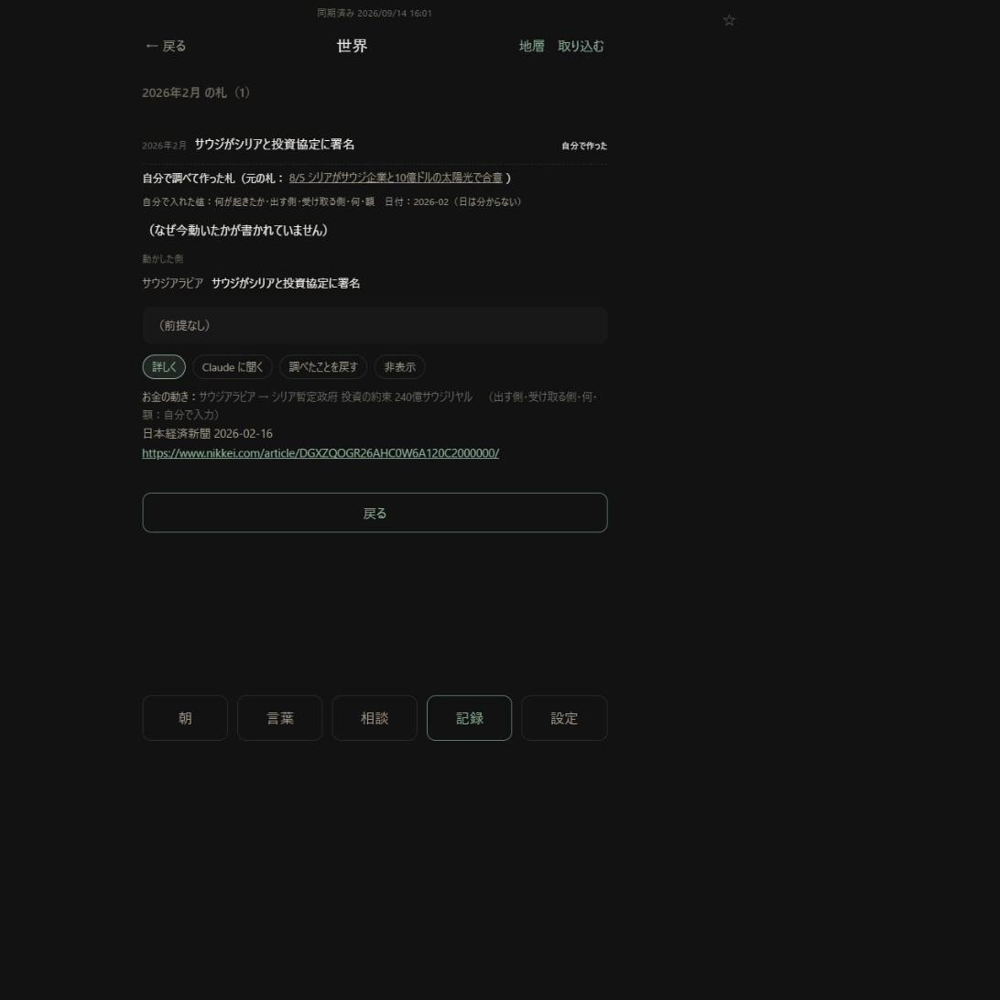

# 月までの日付・調べたことを札にする（v20.45）

日付：2026-09-14　仕様書：[`spec/sekai_nodo_fuda.md`](../spec/sekai_nodo_fuda.md)
公開：v20.45（GitHub Pages で新しい版が出ていることを確かめた）

## したこと

1. **月までの日付**：戻した記録で `2026-02` を正しい日付として持ち「2026年2月」と出す。前の版が「形が正しくない」にしていた8件も、読み込みで日付として扱う（文字は同じ）。年だけ・四半期・月が13などは薄い字の「日付の書き方：…」
2. **赤い字**は url の形が正しくない・長くて切った、の2つだけ。「書かれていた種類」も薄い字に
3. **事実なら［札にする］**（お金の動きが無くても）。欄：何が起きたか（字数つき・40字まで）／日付（年月日・月まで）／動かした側／お金の動きの種類・出す側・受け取る側・何・額／出典／url／元の札とのつながり
4. **押せる・押せない**：40字超・日付の形・未来・出す側も受け取る側も空・url 空・url を開く前・［書いてあった］の前は［札を作る］を押せない。url を書き換えると開く前に戻る
5. **誰が入れたか**：欄の右に「チャット」「自分で入力」をその場で出す。札を作ると、記録の件に `cardBy`（欄ごと）・`cardValues`（その時の値）・`datePrec`、作った札に `self`（記録の番号・欄ごと・日の精度）
6. **月までの札**：札の日付は月の1日。一覧・札の中・主体の時系列などで「2026年2月」、プロンプトの素材では「2026-02（日は分からない）」
7. **地図**：月までの札は、その月の最後の日が期間に入っていれば描く（地図の元の関数の1か所）
8. **重複の確かめ**：月までの札はその月の中（と前後3日）を見る。**すでにある札が月までのときも、その月の中を見る**（下の「足した所」）
9. 自分で作った札：一覧に「自分で作った」、札の頭に「自分で調べて作った札（元の札：…）」と「自分で入れた値：…」、お金の動きの行に「（額：自分で入力）」。読む回には入れない。お金の鎖に記録の前後をつなぐ

## 仕様書から足した・変えた所

| 何を | なぜ |
|---|---|
| **すでにある月までの札に対しても、その月の中で重複を見る** | 仕様書は「これから作る札が月まで」のときだけだった。それだと、自分で作った「2026年2月の協定」があっても、朝の取り込みで「2026-02-16 の同じ協定」が来たとき重複と気づかない。試しで気づいた |
| お金の動きの「種類」（お金・物・人）を選べるようにした | 札のお金の動きには種類がある。選べないと物・人の動きもお金として作られる |
| 開けなかった url を、欄の下に並べて出す | 同じ url を2回貼らないように |
| 札を作った結果の1行を、記録の「札にした」の下に出す | 作ると欄が閉じるので、結果が見えなくなった |

## 日付を出す所（仕様書で「実装のとき数える」とした件）

- 札の日付を短く出していた所は **13か所。全部**を月までの表示に通した（札の一覧・再会の「前は」・つながる札・お金の一覧4種・地層のお金の動き・主体の時系列・概念の依頼文・札の画面の見出し・地図で選んだ線・直近のお金の動きの素材）
- プロンプトで札の日付を書く所は **5か所。全部**「2026-02（日は分からない）」に（読む回・答え合わせ・［Claude に聞く］の札と主体・まとめの依頼文）
- 置き換えのとき、新しく作った関数の中の1か所まで置き換えてしまい、関数が自分を呼び続けて止まる間違いをした。ブラウザの試しで見つけて直し、手元の試しにも「日まで分かる札の表示」を足した

## 確かめたこと

**手元の試し（62通り、全部通った。第1段・v20.44 の分を含む）**
- 月まで・月末（うるう年の2月29日）・表示・前の版の8件の読み込み・ほかの形は書かれたまま
- 誰が入れたか：直さない＝チャット／縮めた・足した＝自分で入力／貼った url＝自分で入力
- 押せる・押せない（40字・空・月までの形・未来の月・年月日の形・未来の日・出す側も受け取る側も空・url 空・開く前・開いた後・記録で確かめ済み・url を書き換えた）
- 地図：今日 9/14 で、月までの `2026-06` は描く、`2026-05` は描かない、年月日の 6/1 は描かない

**偽の GitHub と2台に見立てたブラウザ（試し用のデータ＋本人が戻した本物の記録2件の写し。本物の GitHub には触っていない）**

| 確かめ | 結果 |
|---|---|
| 本物の記録の月までの日付8件 | 全部「2026年2月」などで出た。赤い字 0件 |
| シリアの記録の［札にする］ | 14件に出た（お金の動きが無い事実にも） |
| シリアの「2026年2月にシリアと投資協定に署名」を札にする | 最初は「45字」で押せない → **本物のキーで**「サウジがシリアと投資協定に署名」と打つ → 出す側「サウジアラビア」・受け取る側「シリア暫定政府」・何「投資の約束」を本物のキーで打つ → 額は数字が打てず（下）欄に入れた → ［url を開く］→［書いてあった］→［札を作る］ |
| 作った札 | `w_20260201_…`、日付 2026-02-01、「日は分からない」、読んだ日は今日、確度なし。**自分で入力：何が起きたか・出す側・受け取る側・何・額／チャット：日付・動かした側・出典・url** が記録と札の両方に |
| 元の札（シリアの太陽光） | **作る前と1文字も違わない** |
| 読む回 | 作った札は選ばれない |
| JPモルガンの件：開けない url を貼る → ［開けなかった・書いてなかった］ | url の欄が空になり、記録に url と日時が残った。件は残った |
| JPモルガンの件：縮めた文と別の url で札にする（元の札の「この動きの前」） | `w_20250917_…`。自分で入力：何が起きたか・url。お金の鎖に「作った札 → PIF の札」がつながった。**PIF の札は1文字も違わない**。主体に「JPモルガン」が足された（国はまだ分からない） |
| もう一度同じ「2026年2月の協定」を月までで作る | 「似た札がもうあります：2026年2月 サウジがシリアと投資協定に署名（作りませんでした）」 |
| 朝の取り込みの形で「2026-02-16 同じ協定」を入れる | 重複で止まった（すでにある月までの札に当たった）。「2026-03-10」は通った |
| 端末Bで開く | 一覧「2026年2月 ｜ サウジがシリアと投資協定に署名 ｜ 自分で作った」、札の頭に元の札と「自分で入れた値：…」。GitHub に札の `self` と記録の `cardBy` が届いていた |

**決まった8項目**：検索の5つの欄に本物のキーで打って全部入った。地図の地域・種類、「場所不明 4件」から一覧へ行って戻る、札の「詳しく」も動いた。札にする欄の「何が起きたか」「出す側」「受け取る側」「何」にも本物のキーで2文字以上打って入った。エラー0。

## 確かめられなかったこと・気づいたこと

- **ブラウザを操作する道具で、英数字・数字がまた打てなかった**（日本語は入る。アプリの問題ではない）。額「240億サウジリヤル」の「240」、url、「JP」を含む文は、欄に文字を入れて入力の知らせを起こす形で確かめた
- 地図の本物の画面で月までの札が描かれるかは、地図が国の場所を読むため試しのページでは描けず、**判定の関数（期間に入るか）で確かめた**。端末で本人が見る
- 端末Bで、作った札の月（2026年2月・2025年9月）は起動時に読み込まれていないので、世界の画面の一覧には出ない（古い月は起動時に読まない前からの作り）。記録の［札にした（押すと開く）］からは月を読み込んで開ける
- 自分で作った札を開くと「（なぜ今動いたかが書かれていません）」「（前提なし）」が出る（今の札の空欄の出し方のまま）
- JPモルガンは国が分からないので、地図では「場所不明」に入る見込み。主体の画面の「国」から直せる

## 失うもの

- チャットの文を1文字でも直すと「自分で入力」になる
- 自分で作った札の中に欄が1つ増えた。**古い版の端末がその月を書き直すと札の中の印は落ちる**（記録の側に同じものがあるので表示は変わらない）→ 両端末を v20.45 にしてから札にしてほしい
- 月までの札は地図に1か月ぶん広めに入る。月の中に別の似た出来事があると重複と言われることがある（理由と相手の札を出す）
- すでにある月までの札に対しても月の中で重複を見るので、同じ月に似た別の出来事を AI が集めたとき、朝の取り込みで落ちることがある（落ちた数は取り込みの結果の「重複」に出る）

## 端末で見てほしいこと

1. **両端末を v20.45 にしてから**
2. PIF とシリアの記録の「月まで」の日付が赤い字でなくなっていること
3. **シリアの記録から1件を札にする**（お金の動きを自分で入れる）
4. **JPモルガンの200億ドルを札にする**（url を探して貼る）
5. 作った札で「自分で入れた値」とチャットの値が見分けられること。元の札が変わっていないこと
6. 月までの札が地図に出る／出ない（直近90日の月なら出る）
