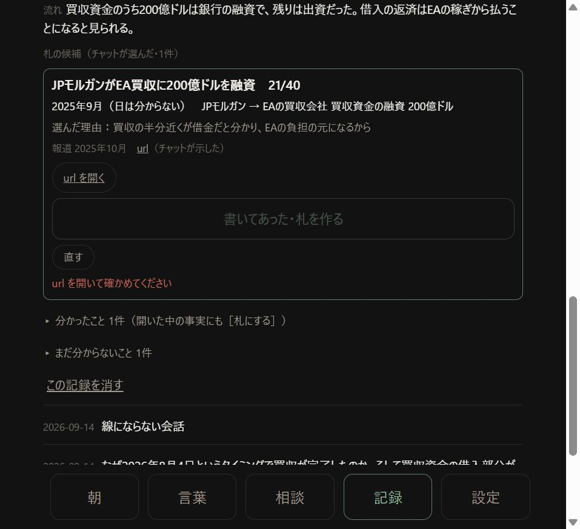

# 札の候補をチャットに作らせる（v20.46）

日付：2026-09-14　仕様書：[`spec/sekai_nodo_kouho.md`](../spec/sekai_nodo_kouho.md)
公開：v20.46（GitHub Pages で新しい版が出ていることを確かめた）

## したこと

1. **まとめの依頼文**に「札の候補（0〜2件）」と「流れ（2〜3文）」の節を足した
2. **取り込み**：候補の欄が書かれていたときだけ候補を持つ（空の配列は0件）。3件以上も全部残す。url・出す側と受け取る側が欠けた候補も残し、文の無い候補だけ数を出して候補にしない
3. **画面**（候補のある記録）：流れ → 札の候補の枠（文と字数・日付・お金の動き・選んだ理由・出典 url・［url を開く］［書いてあった・札を作る］［直す］・次に何をすればいいかの1行）→ ▸ 分かったこと（畳む）→ ▸ まだ分からないこと（畳む）
4. **［書いてあった］と［札を作る］を1つのボタンに**（候補の枠と、分かったことの［札にする］の欄の両方）。url を開くまで押せない。押すと、確かめた印を残してから札を作る（作れなくても印は残る）
5. 候補0件：「この会話から線になる動きは選ばれませんでした（分かったことから手で札にできます）」
6. 候補の無い今までの記録（PIF・シリア）は今の形のまま

## 仕様書から足した・変えた所

| 何を | なぜ |
|---|---|
| 候補の枠の「次に何をすればいいか」の1行で、「url を開いて確かめてください」だけは赤くしない | いつもの次の手順なのに、間違いの色で出ていた（画面写しで見て気づいた） |
| 候補の枠で［直す］を開いている間は、枠の［url を開く］［書いてあった・札を作る］を隠す（開いた欄の中のボタンを使う） | 同じ動きのボタンが2組並ぶと迷う |

## 依頼文の本物の字数

| 札 | 前（v20.45） | v20.46 | 見込み |
|---|---|---|---|
| PIF・EA の札 | 1,643字 | **2,387字** | 約2,100字 |

**見込みより約290字多かった。** 候補の節の決まり（7行）と出力形式の例が、見込みより長かった。

## 確かめたこと

**手元の試し（79通り、全部通った。第1段〜v20.45 の分を含む）**
- 依頼文に候補と流れの節、「必ず書く」「url が無ければ選ばない」「"cards": []」が入る
- 候補2件・0件・候補の欄が無い（今までの形）・5件（文の無い1件は候補にせず、4件を全部残し「多かった」）・url の無い候補・出す側も受け取る側も無い候補・45字の候補、の取り込みと結果の1行
- 読み込みで候補と流れと札にしたあとの欄が残る。候補の欄が無い記録には足さない
- 候補の下書き：直さなければ全部「チャット」。開く前は押せない・開いたら押せる・40字超と url なしは押せない

**偽の GitHub と2台に見立てたブラウザ（試し用のデータ＋本人が戻した記録2件の写し。本物の GitHub には触っていない）**

| 確かめ | 結果 |
|---|---|
| 候補の無い今までのシリアの記録 | 畳まれず、事実14件に［札にする］（今の形のまま） |
| 候補2件のまとめを取り込む | 「取り込みました：札の候補 2件・…」。流れ → 候補2件 → ▸ 分かったこと 2件 → ▸ まだ分からないこと 1件 |
| 20字の候補を［url を開く］→［書いてあった・札を作る］ | **押す2回で札になった**。値は全部「チャット」、元の札とのつながりは「この動きの前」、月まで（2026年2月）。お金の鎖につながった。**元の札は1文字も変わらない** |
| 48字の候補 | 「何が起きたかを40字までにしてください（今 48字）（［直す］で直せます）」で押せない →［直す］→ **本物のキーで**26字に縮める →［url を開く］→［書いてあった・札を作る］で作れた。「何が起きたか」だけ「自分で入力」、候補の元の48字の文も記録に残る |
| 候補0件のまとめ（PIF の札） | 「この会話から線になる動きは選ばれませんでした（分かったことから手で札にできます）」 |
| 畳んだ分かったことを開いて［札にする］ | 開いたまま欄が開き、ボタンは［書いてあった・札を作る］の1つ |
| 端末Bで開く | 流れ・札にした候補2件（「値は全部チャットが書いたもの」「自分で入れた値：何が起きたか」）・畳んだ分かったこと。札にしていない候補の枠も同じ見え方 |

**決まった8項目**：検索の5つの欄に本物のキーで打って全部入った。地図の地域・種類、「場所不明 4件」から一覧へ行って戻る、札の「詳しく」も動いた。候補の［直す］の欄にも本物のキーで打って入った。エラー0。

## 測れないこと

- 本物のチャットが、候補を 0〜2件、40字以内でうまく選ぶか。選んだ理由が読めるか
- 長い会話の続きで、40字以内・url のある動きだけ、を守るか
- 線になる動きの無い会話で、本当に0件と返すか

## 失うもの

- 依頼文が長くなった（PIF の札で 1,643字 → 2,387字）
- 候補はチャットが選んだもの。選び方の癖が先に見える線になる（選んだ理由で気づけるようにした）
- 流れは要約。分かったことは畳まれる（候補のある記録だけ）
- ［書いてあった］だけを先に押しておくことはできなくなった
- **v20.45 の端末が同じ月の記録ファイルを書き直すと、候補と流れが消える**（分かったこと・作った札は残る）→ **両端末を v20.46 にしてから、候補のあるまとめを取り込んでほしい**

## 端末で見てほしいこと

1. **両端末を v20.46 にしてから**
2. ［Claude に聞く］で調べたチャットの続きに［まとめ方をコピー］を貼り、返ってきた JSON を［この札に取り込む］
3. 候補が 0〜2件で出るか、選んだ理由が読めるか
4. **1件を［url を開く］と［書いてあった・札を作る］の2回で札にできるか**
5. 線になる動きの無い会話で、0件と出るか
6. 畳んだ「分かったこと」から、今までどおり手で札にできるか
7. 候補の文が40字を超えていたら作れず、［直す］で縮めて作れるか
